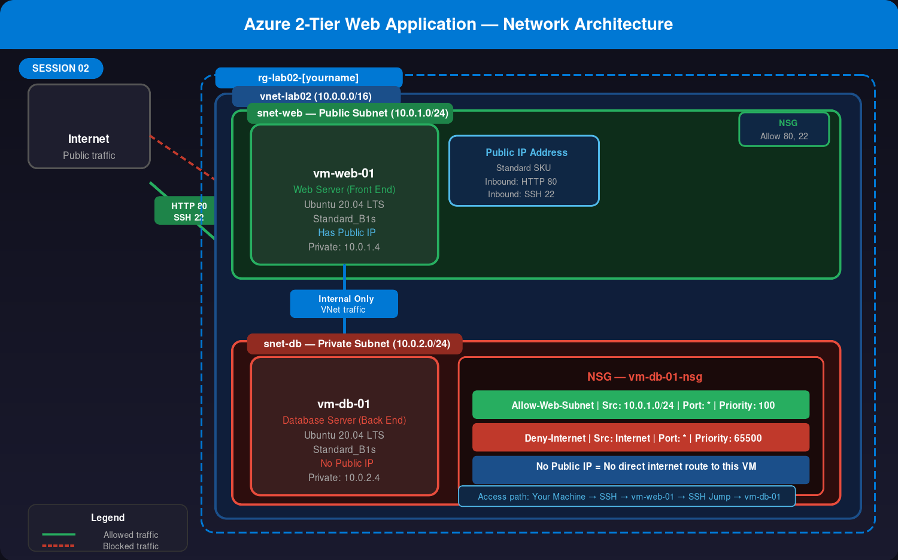

# azure-2tier-webapp

[Watch Me Work](https://azure.microsoft.com/free/)

# 🔐 Watch Me Work — Session 02: Building a Secure 2-Tier Web Application on Azure


> **Series:** Watch Me Work — Real Builds. Real Security. Real Lessons.
> **Session 02 of ??** | ⏱️ Estimated Time: 60 Minutes | 💰 Cost: < $0.05 (delete resources after) | 👤 Author: Wayne Owens

---

## 📌 What This Session Is About

In Session 01, we hosted a static website on Azure Blob Storage — no servers, no infrastructure. Clean and simple.

Session 02 is where we step into **real infrastructure**.

In this session, I built a classic **2-tier IaaS architecture** on Azure — a Web Server exposed to the internet and a Database Server locked away on a private network, accessible only through the web server. No direct internet path to the database. Ever.

This is the pattern behind almost every production web application you've ever used. Banks, e-commerce platforms, healthcare portals — they all start with this same fundamental design.

Understanding how to build it is step one. Understanding how to **secure it** is what this session is really about.

---

## 🏗️ Architecture



### How the Traffic Flows

```
                    ✅ ALLOWED
Internet ──────────────────────────► vm-web-01 (Public Subnet)
  │                                        │
  │  ⛔ BLOCKED                            │  🔒 Internal VNet traffic only
  │  (No Public IP + NSG Deny)             ▼
  └──────────────────────────────► vm-db-01 (Private Subnet)
```

### What Each Component Does

| Component | Role | Key Setting |
|---|---|---|
| `vnet-lab02` | The private network that connects everything | Address space: 10.0.0.0/16 |
| `snet-web` | Public subnet — web-facing tier | 10.0.1.0/24 |
| `snet-db` | Private subnet — database tier | 10.0.2.0/24 |
| `vm-web-01` | Web Server — the only server the internet can reach | Has Public IP |
| `vm-db-01` | Database Server — completely hidden from the internet | No Public IP |
| NSG (web) | Firewall rules for the web server | Allows HTTP 80 + SSH 22 |
| NSG (db) | Firewall rules for the database server | Allows only traffic from `snet-web` |

---

## 🎯 Why This Matters — The Security Context

> Every cloud security engineer needs to understand this pattern. It shows up everywhere.

The 2-tier architecture exists to answer one question: **what happens if someone compromises your web server?**

Without network segmentation, the answer is terrifying — an attacker who owns your web server automatically owns your database, your customer records, your everything.

With proper segmentation:

- The web server sits in a **public subnet** — it's designed to take hits from the internet
- The database server sits in a **private subnet** — it has no public IP, no direct internet route, and an NSG that only allows traffic from the web server's subnet
- Even if an attacker fully compromises `vm-web-01`, they still can't reach `vm-db-01` from the internet — they'd have to pivot through the web server first, and we can detect that

**This is the principle of defense-in-depth.** Layers of security controls, so one failure doesn't mean total compromise.

> 💡 In a real security assessment, finding a database server with a public IP and no NSG restrictions is a **CRITICAL** finding. This lab shows you exactly why.

---

## ✅ Prerequisites

Before starting this session, make sure you have:

- [ ] An active **Azure Subscription** — [Create a free account](https://azure.microsoft.com/free/)
- [ ] Access to the **Azure Portal** — [portal.azure.com](https://portal.azure.com)
- [ ] A **terminal** — PowerShell, Terminal (Mac/Linux), or Windows Terminal
- [ ] Completed **Session 01** — or at least familiarity with Resource Groups and the Azure Portal

---

## 📋 Lab Variables — Use These Exactly

Consistent naming makes management and cleanup much easier. Substitute `[yourname]` with your name throughout.

| Variable | Value |
|---|---|
| Resource Group | `rg-lab02-[yourname]` |
| Location | `East US` |
| Virtual Network | `vnet-lab02` |
| VNet Address Space | `10.0.0.0/16` |
| Public Subnet | `snet-web` — `10.0.1.0/24` |
| Private Subnet | `snet-db` — `10.0.2.0/24` |
| Web Server VM | `vm-web-01` |
| Database VM | `vm-db-01` |
| VM Image | `Ubuntu Server 20.04 LTS` |
| VM Size | `Standard_B1s` |
| SSH Key Pair | `key-lab02` |

> ⚠️ **Keep your `.pem` key file safe.** You will not be able to download it again after creation. If you lose it, you'll need to reset the VM's SSH credentials or create a new key pair.

---

## 🚀 Step-by-Step Deployment

### Phase 1 — Build the Network Foundation

> Think of the Virtual Network as the building. The subnets are the floors. We're setting up the structure before moving any furniture in.

1. In the Azure Portal, search for **Virtual Networks** → click **+ Create**

2. Fill in the **Basics** tab:

| Field | Value |
|---|---|
| Resource Group | Create new → `rg-lab02-[yourname]` |
| Name | `vnet-lab02` |
| Region | `East US` |

3. Go to the **IP Addresses** tab:
   - Delete the default subnet if one exists
   - Set the address space to `10.0.0.0/16`
   - Add **Subnet 1**:
     - Name: `snet-web`
     - Range: `10.0.1.0/24`
   - Add **Subnet 2**:
     - Name: `snet-db`
     - Range: `10.0.2.0/24`

4. Click **Review + create** → **Create**

> 💡 **Why /24?** A /24 subnet gives you 256 addresses (254 usable). For a lab, that's more than enough. In production, you'd size subnets based on expected growth — a conversation worth having in any architecture review.

---

### Phase 2 — Deploy the Web Server (Front End)

> This is the server the internet will talk to. It needs a public IP and open ports for HTTP and SSH.

1. Search for **Virtual Machines** → click **+ Create** → **Azure virtual machine**

2. Fill in the **Basics** tab:

| Field | Value |
|---|---|
| Resource Group | `rg-lab02-[yourname]` |
| Virtual machine name | `vm-web-01` |
| Region | `East US` |
| Image | `Ubuntu Server 20.04 LTS` |
| Size | `Standard_B1s` |
| Authentication type | `SSH public key` |
| Key pair name | `key-lab02` |
| Public inbound ports | `Allow selected ports` |
| Select inbound ports | `HTTP (80)` and `SSH (22)` |

3. Go to the **Networking** tab:
   - Virtual network: `vnet-lab02`
   - Subnet: `snet-web` ✅
   - Public IP: **Create new** (Standard SKU)

4. Click **Review + create** → **Create**

5. **Download the `.pem` private key file** when prompted — save it somewhere safe on your machine

> ⚠️ **Windows users:** You may need to run `chmod 400 key-lab02.pem` before SSH will accept the key. If you're on Windows, use PowerShell or WSL.

---

### Phase 3 — Deploy the Database Server (Back End)

> This server represents our database tier. The most important thing to get right: **no public IP.**

1. Search for **Virtual Machines** → click **+ Create** → **Azure virtual machine**

2. Fill in the **Basics** tab:

| Field | Value |
|---|---|
| Resource Group | `rg-lab02-[yourname]` |
| Virtual machine name | `vm-db-01` |
| Region | `East US` |
| Image | `Ubuntu Server 20.04 LTS` |
| Size | `Standard_B1s` |
| Authentication type | `SSH public key` |
| Key pair name | Use existing → `key-lab02` |
| Public inbound ports | `Allow selected ports` → `SSH (22)` |

3. Go to the **Networking** tab — **this is the critical step:**

| Field | Value |
|---|---|
| Virtual network | `vnet-lab02` |
| Subnet | `snet-db` ← **change this from snet-web** |
| Public IP | **None** ← **this is the most important setting in this phase** |

4. Click **Review + create** → **Create**

> 🔴 **Why no Public IP?** A database server with a public IP is one of the most dangerous misconfigurations in cloud environments. Removing the public IP means there is no route from the internet to this server — period. NSG rules alone aren't enough; removing the attack surface entirely is always the right call.

---

### Phase 4 — Validate Connectivity (The Jump)

> `vm-db-01` has no public IP, so you can't SSH into it from your home machine directly. Instead, you use `vm-web-01` as a stepping stone — a "jump host."

**Step 1 — Get the DB Server's Private IP**

1. Go to the `vm-db-01` resource in the Portal
2. On the Overview page, find **Private IP address** — it should be `10.0.2.4`
3. Copy it

**Step 2 — SSH into the Web Server**

```bash
# Set correct permissions on your key (Mac/Linux)
chmod 400 key-lab02.pem

# SSH into the web server using its Public IP
ssh -i key-lab02.pem azureuser@[PUBLIC-IP-OF-vm-web-01]
```

> Replace `[PUBLIC-IP-OF-vm-web-01]` with the public IP shown on the `vm-web-01` Overview page.

**Step 3 — Test Connectivity to the Database Server**

Once inside `vm-web-01`, run:

```bash
# Ping the database server's private IP
ping 10.0.2.4
```

You should see replies like this:

```
PING 10.0.2.4 (10.0.2.4) 56(84) bytes of data.
64 bytes from 10.0.2.4: icmp_seq=1 ttl=64 time=1.23 ms
64 bytes from 10.0.2.4: icmp_seq=2 ttl=64 time=0.98 ms
```

**This proves the two servers can communicate inside the VNet.** Press `Ctrl + C` to stop.

> 💡 **This is called a jump host pattern** — also known as a bastion host. The web server acts as a controlled entry point into the private network. In production, Azure has a dedicated service for this: **Azure Bastion**, which eliminates the need to expose SSH ports publicly at all. That's a future session.

---

### Phase 5 — Lock Down the Database Server (NSG)

> Right now `vm-db-01` accepts traffic from anywhere inside the VNet. Let's tighten that to only the web subnet.

1. In the Portal, go to `vm-db-01` → click the **Networking** tab
2. Click the **Network Security Group** link (it will have a name like `vm-db-01-nsg`)
3. Click **Inbound security rules** → **+ Add**
4. Fill in the rule:

| Field | Value |
|---|---|
| Source | `IP Addresses` |
| Source IP / CIDR | `10.0.1.0/24` (the web subnet — only this range can talk to the DB) |
| Source port ranges | `*` |
| Destination | `Any` |
| Service | `Custom` |
| Destination port ranges | `*` (or `3306` for MySQL / `5432` for PostgreSQL if you install a DB) |
| Action | `Allow` |
| Priority | `100` |
| Name | `Allow-Web-Subnet` |

5. Click **Add**

**What this rule does in plain English:**
> "Only allow traffic into this server if it comes from the 10.0.1.0/24 subnet (our web tier). Block everything else."

The default Azure NSG also includes an implicit **Deny All** rule at priority 65500 — so anything not explicitly allowed is automatically dropped.

> 🔐 **Security note:** Even without a Public IP, this NSG rule adds an explicit layer of enforcement. Defense-in-depth means we don't rely on a single control. If someone were to accidentally assign a public IP to this VM in the future, the NSG would still block unauthorized access.

---

## 🔧 Troubleshooting

### ❌ Ping fails from vm-web-01 to vm-db-01

Work through this checklist:

- [ ] Is `vm-db-01` deployed into `snet-db`? Check the Networking tab on the VM — the subnet must be `snet-db`, not `snet-web`
- [ ] Are both VMs in the same Virtual Network (`vnet-lab02`)? Go to each VM → Networking and verify
- [ ] Is `vm-db-01` running? Check the Overview page — Status should show **Running**
- [ ] Is the NSG blocking ICMP? By default Azure allows ICMP within a VNet — but if a custom Deny rule was added, it may be blocking ping

### ❌ Can't SSH into vm-db-01 from my home machine

This is **expected behavior** — not a bug.

`vm-db-01` has no public IP, which means there is no route from the internet to that server. This is intentional. To access it you must:

1. SSH into `vm-web-01` first (it has a public IP)
2. From inside `vm-web-01`, SSH to `vm-db-01` using its private IP

> **Advanced note:** To SSH from `vm-web-01` into `vm-db-01`, you would need to copy your `.pem` key onto the web server first — or use SSH agent forwarding (`ssh -A`). This is covered in a future session.

### ❌ "Permission denied" when SSHing into vm-web-01

```bash
# Fix key file permissions (Mac/Linux)
chmod 400 key-lab02.pem

# Then try again
ssh -i key-lab02.pem azureuser@[PUBLIC-IP]
```

On Windows, right-click the `.pem` file → Properties → Security → remove all permissions except your own user account.

---

## 🔐 Security Considerations

> This is where we move from "it works" to "it's secure."

### What We Got Right
- ✅ **No public IP on the database server** — eliminates the entire internet attack surface for the DB tier
- ✅ **NSG explicitly restricts DB access** to only the web subnet — even internal VNet traffic is controlled
- ✅ **Subnet segmentation** — web and database tiers are isolated at the network level
- ✅ **SSH key authentication** — no passwords, which eliminates brute-force credential attacks

### What to Harden Next (Production Considerations)

| Risk | Current State | Production Fix |
|---|---|---|
| SSH port 22 open to internet on web server | ⚠️ Open | Restrict to your IP only, or use Azure Bastion |
| No flow logs | ⚠️ Off | Enable NSG Flow Logs → Log Analytics for traffic visibility |
| No threat detection | ⚠️ Off | Enable Microsoft Defender for Servers |
| Jump host is also the web server | ⚠️ Acceptable for lab | Use dedicated Azure Bastion in production |
| No disk encryption | ⚠️ Default only | Enable Azure Disk Encryption (ADE) |
| VM updates not automated | ⚠️ Manual | Enable Azure Update Manager |

> 💡 **Real-world context:** In a security audit, a database VM with a public IP and open NSG rules is logged as a **CRITICAL** finding. This lab shows you exactly how to prevent it — and exactly what assessors look for.

---

## ✅ Validation Checklist

Run through this before calling the session complete:

- [ ] `vnet-lab02` exists with address space `10.0.0.0/16`
- [ ] Both subnets (`snet-web` and `snet-db`) are visible under the VNet
- [ ] `vm-web-01` is in `snet-web` and has a Public IP
- [ ] `vm-db-01` is in `snet-db` and has **no Public IP**
- [ ] Ping from `vm-web-01` to `10.0.2.4` returns replies
- [ ] NSG on `vm-db-01` has the `Allow-Web-Subnet` rule at priority 100
- [ ] You can SSH into `vm-web-01` from your terminal

---

## 💡 Lessons Learned

These are the things I hit during this session that nobody warns you about:

1. **The subnet selection on the DB VM is easy to miss.** The portal defaults to the first subnet. If you don't change it to `snet-db`, your "private" database server ends up in the public subnet. Always double-check the Networking tab before clicking Create.

2. **"No Public IP" is the most powerful security control in this lab.** An NSG can be misconfigured. A public IP that doesn't exist can never be exploited. Remove the attack surface before layering other controls on top.

3. **The jump host pattern feels awkward at first.** Having to SSH into one server just to reach another seems roundabout — until you understand why it exists. It's a chokepoint: all access to private resources flows through one controlled entry point that you can monitor, log, and lock down.

4. **Azure assigns private IPs sequentially starting at .4** — the first three addresses in any subnet are reserved by Azure. So `10.0.2.4` will almost always be your first VM in `snet-db`. Good to know when you're troubleshooting connectivity.

5. **Standard_B1s is tiny — and perfect for learning.** It's the cheapest VM size that still runs Ubuntu comfortably. In production, your VM size is driven by workload requirements, not cost alone. But for a lab? B1s gets the job done.

---

## 🧹 Cleanup — Do This When You're Done

> Always clean up. It's a professional habit and protects your Azure credits.

**Option 1 — Azure Portal (Recommended for beginners):**

1. Go to **Resource Groups**
2. Click `rg-lab02-[yourname]`
3. Click **Delete resource group**
4. Type the resource group name to confirm
5. Click **Delete**

This deletes the VNet, both VMs, both NSGs, the public IP, and all disks in one step.

**Option 2 — Azure CLI (Faster once you're comfortable):**

```bash
az group delete --name rg-lab02-[yourname] --yes --no-wait
```

> `--no-wait` returns control to your terminal immediately while Azure deletes in the background. `--yes` skips the confirmation prompt.

---

## 🎥 Video Walkthrough

> 📹 **Loom walkthrough coming soon** — I'll walk through every phase live, including the connectivity test and NSG configuration.
> Follow the repo to get notified when it drops.

---

## 🗺️ What's Next

| Session | Topic |
|---|---|
| Session 03 | Add Azure Bastion — eliminate public SSH exposure entirely |
| Session 04 | Enable NSG Flow Logs + query traffic in Log Analytics |
| Session 05 | Deploy a real web app on vm-web-01 + connect to a database |
| Session 06 | Automate this entire deployment with Terraform |

---

## 📚 Resources

- [Azure Virtual Network Documentation](https://learn.microsoft.com/en-us/azure/virtual-network/)
- [Network Security Groups Overview](https://learn.microsoft.com/en-us/azure/virtual-network/network-security-groups-overview)
- [Azure Bastion Documentation](https://learn.microsoft.com/en-us/azure/bastion/)
- [NSG Flow Logs](https://learn.microsoft.com/en-us/azure/network-watcher/network-watcher-nsg-flow-logging-overview)

---

## 🤝 Connect

- 💼 [LinkedIn](https://linkedin.com/in/YOUR-PROFILE)
- 🐙 [GitHub](https://github.com/owens1wayne)

> ⭐ **If this helped you, drop a star on the repo** — it helps others find it.

---

*Part of the Watch Me Work series — real cloud builds, real security lessons, documented step by step.*
