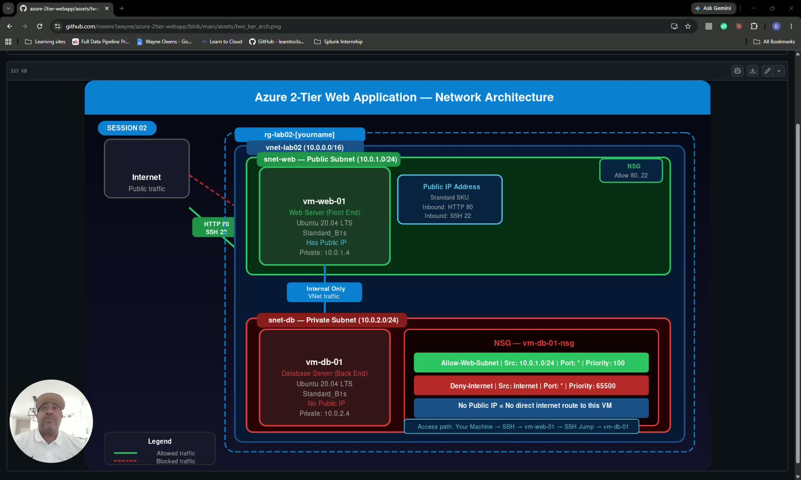
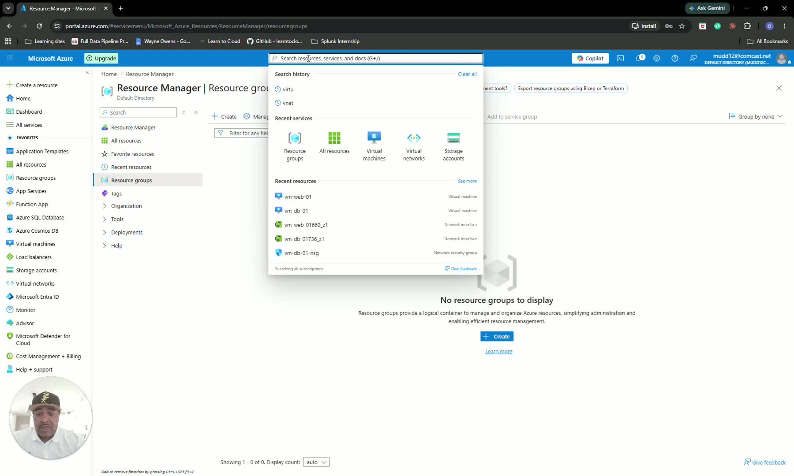
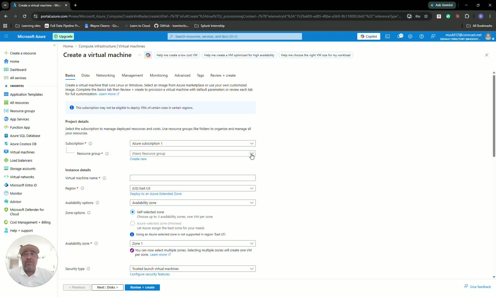
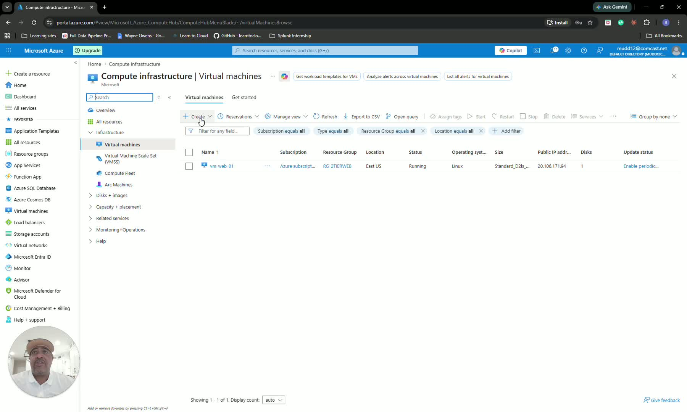
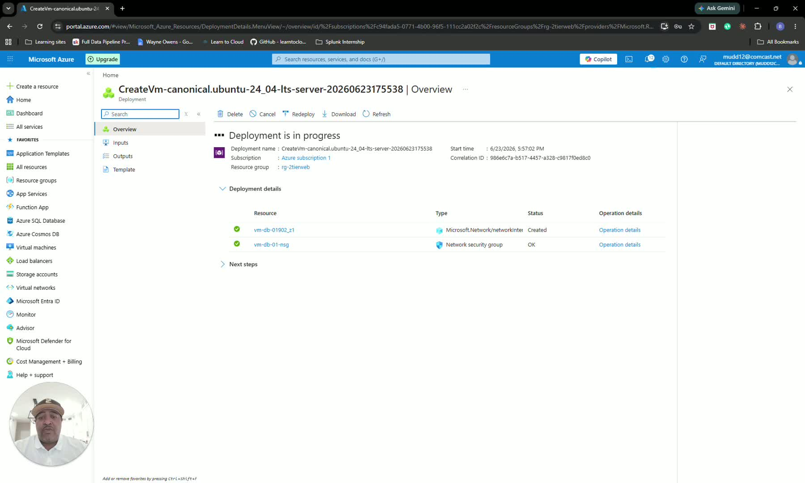
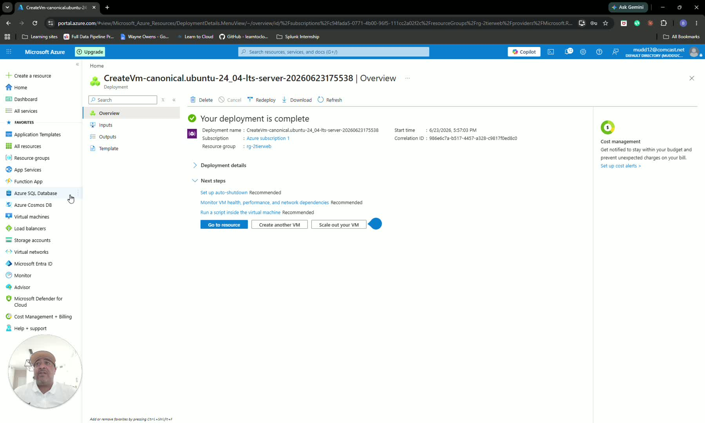
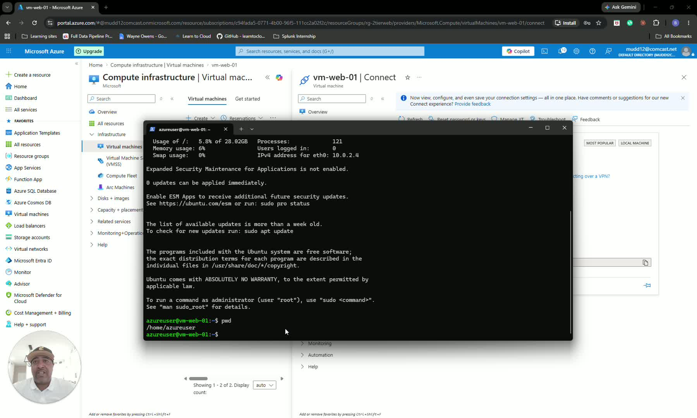
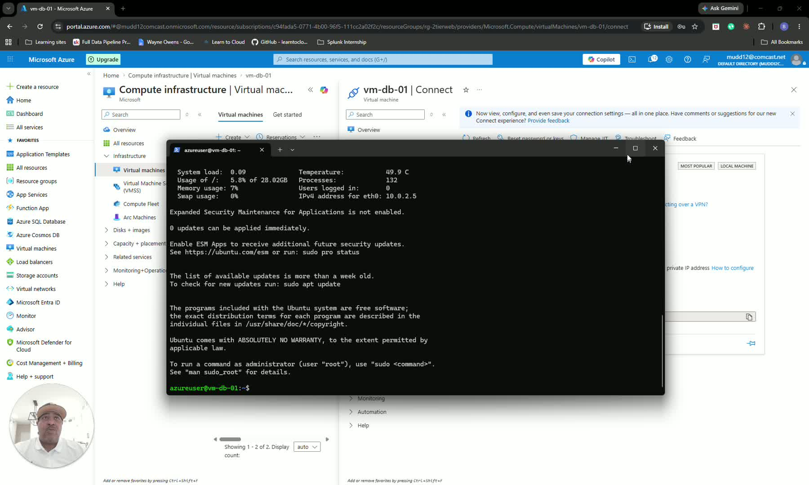
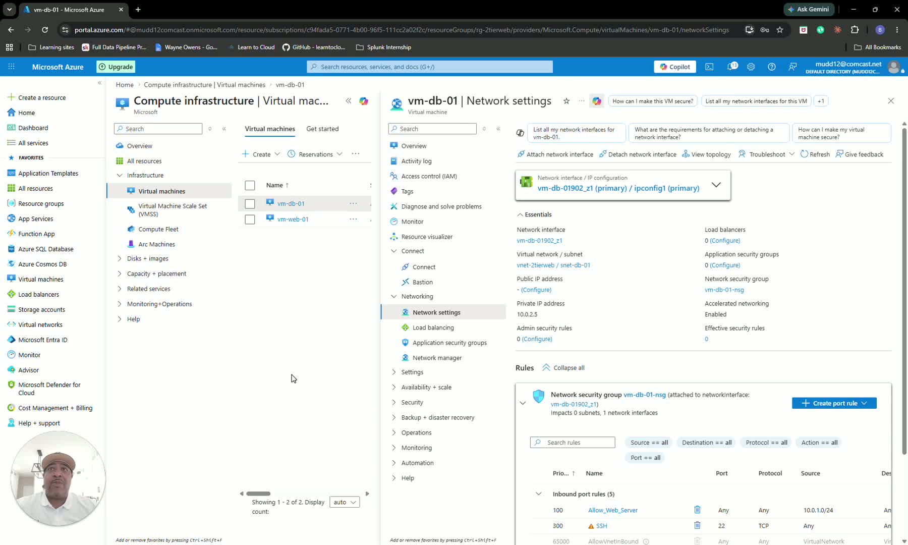

## SOP: Build and Secure an Azure Two-Tier Web Application

### Objective

This SOP explains how to create a simple Azure two-tier environment with a web server and a database server in separate subnets. It also covers how to connect to the web server, access the database server through it, and restrict database access with a network security rule.

### Key Steps

 

**1. Define the Azure architecture and naming approach** [0:00](https://loom.com/share/bf0721f0a0ee44e795221a92bd9f7889?t=0)

- Confirm the goal is to build a **two-tier Azure web application** with: 
  - One **web server VM** exposed to the internet
  - One **database VM** accessible only from the web server
- Use a clear naming convention for all Azure resources so they are easy to identify later.
- Plan the environment around a single resource group, one virtual network, and two subnets.

 

**2. Create the virtual network and subnets** [1:10](https://loom.com/share/bf0721f0a0ee44e795221a92bd9f7889?t=70)

- In the Azure portal, go to **Virtual networks** and create a new VNet.
- Select the correct Azure subscription and region (**U.S. East** in the transcript).
- Set the VNet address space and add two subnets: 
  - **Web server subnet** using the `10.0.1.0/24` range
  - **Database subnet** using the `10.0.2.0/24` range
- Review the configuration and create the VNet.

 

**3. Deploy the web server virtual machine** [3:51](https://loom.com/share/bf0721f0a0ee44e795221a92bd9f7889?t=231)

- Go to **Virtual Machines** and create the first VM for the web server.
- Place it in the same resource group and region as the VNet.
- Use the Ubuntu image and the selected VM size (`Standard D2` in the transcript).
- Configure authentication with a password and use the provided admin username.
- Allow inbound access for: 
  - **Port 80** for web traffic
  - **Port 22** for SSH access
- Ensure the VM is connected to the correct network and has a **public IP address** so it can be reached from the internet.
- Review the settings and create the VM.

 

**4. Deploy the database virtual machine without public access** [5:42](https://loom.com/share/bf0721f0a0ee44e795221a92bd9f7889?t=342)

- Create a second VM in the same resource group and region for the database server.
- Use the same Ubuntu image and VM size as the web server for consistency.
- Configure password-based authentication.
- In the networking settings, set **Public IP = None** so the database VM is not directly exposed to the internet.
- Review the configuration and create the VM.

 

**5. Verify the two-tier environment is deployed correctly** [6:55](https://loom.com/share/bf0721f0a0ee44e795221a92bd9f7889?t=415)

- Confirm the environment now contains: 
  - One resource group
  - One VNet
  - Two subnets
  - One web VM
  - One database VM
- Validate that the web VM is publicly reachable while the database VM is only reachable internally through the VNet.
- Use this structure to emulate a basic web application with a backend database.

 

**6. Connect to the web server VM** [7:47](https://loom.com/share/bf0721f0a0ee44e795221a92bd9f7889?t=467)

- Open the **web server virtual machine** in Azure.
- Select **Connect** and copy the SSH connection string/path.
- Open a terminal session on your local machine.
- Paste the SSH command and authenticate with the VM password.
- Confirm you are successfully logged into the web server VM.

 

**7. Access the database VM through the web server** [8:55](https://loom.com/share/bf0721f0a0ee44e795221a92bd9f7889?t=535)

- From the web server VM, use the internal database VM address to connect.
- Use the web server as a **jump host** because the database VM has no public IP.
- Authenticate when prompted.
- Confirm you can reach the database VM from the web server session.

 

**8. Restrict database access with a network security group rule** [10:01](https://loom.com/share/bf0721f0a0ee44e795221a92bd9f7889?t=601)

- Open the database VM’s **network settings** and locate its **Network Security Group (NSG)**.
- Create a new **inbound port rule** that allows traffic only from the web server subnet.
- Configure the rule with: 
  - **Source:** the web server subnet range (`10.0.1.0/24`)
  - **Destination:** the database VM
  - **Action:** Allow
  - **Priority:** higher than broader allow rules so it is evaluated first
  - **Name:** `AllowWebServer`
- Save the rule to ensure only the web server can initiate access to the database VM.

 

**9. Confirm the final security posture** [11:30](https://loom.com/share/bf0721f0a0ee44e795221a92bd9f7889?t=690)

- Verify the web server remains publicly accessible on **port 80**.
- Verify the database server is **not publicly accessible**.
- Confirm the NSG allows database access only from the web server subnet.
- Document the completed architecture as a secure two-tier Azure deployment.

### Cautionary Notes

- Do not assign a public IP to the database VM.
- Make sure the NSG rule for the database VM is specific enough to avoid allowing broader VNet access than intended.
- Confirm the correct subnet ranges are used before creating resources.
- Use strong credentials for VM access, even in lab environments.
- Ensure port 22 is only exposed where needed and is restricted as much as possible in production.

### Tips for Efficiency

- Use a consistent naming convention for the resource group, VNet, subnets, and VMs.
- Build the VNet and subnets first so VM networking is easier to configure.
- Reuse the same region and VM image for both machines to keep the deployment simple.
- Keep the web server and database server in separate subnets to simplify security control.
- Use the web server as a jump host instead of exposing the database VM directly.

### Link to Loom

<https://loom.com/share/bf0721f0a0ee44e795221a92bd9f7889>
